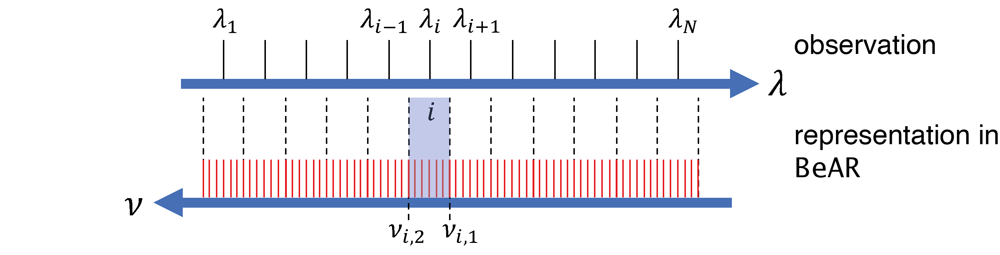
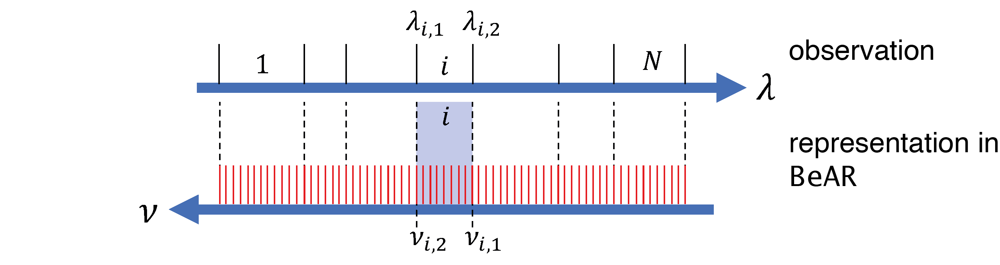
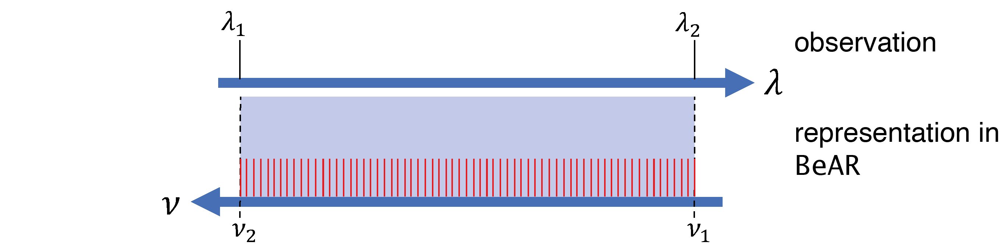
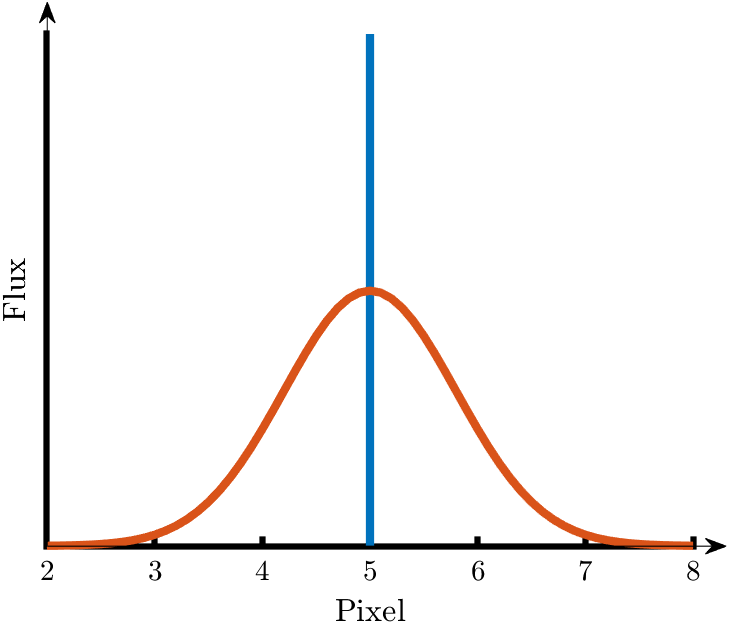

.. _sec:observational_data:

Observations
============

Supported observational types
-----------------------------

BeAR currently supports four different types of observations:

- :ref:`Spectroscopy <sec:spectroscopy>`

- :ref:`Band-Spectroscopy <sec:band_spectroscopy>`

- :ref:`Photometry <sec:photometry>`

- :ref:`High-resolution (cross-correlation) observations <sec:highres_observations>`

Based on the type of observation, the required format of the data files
differs slightly. In the following sections, the three basic types and
their required input formats are described. Observations have to be
provided in wavelength space. Internally, however, BeAR performs the
calculations in wavenumber space.

Typically, the computions are done with a higher spectral resolution than
the observations and then integrated to the observational wavelength structure.
The internal spectral grid is determined by the ``spectral_discretisation`` and
``spectral_resolution`` keys in the ``[retrieval]`` section of the ``retrieval.toml`` file.

For spectroscopy and band spectroscopy obervations, BeAR has the option to
use :ref:`instrument line profiles <sec:instrument_line_profile>`, which typically
spreads the flux at a given wavelength over several adjacent pixels.

Additionally, BeAR can use :ref:`filter transmission functions <sec:filter_response>`. 
While this is typically only used in photometric observations, BeAR also supports 
them for both spectroscopy and band spectroscopy.

Each retrieval calculation needs a separate file with a list of the observational data files 
that should be used. The structure of the file is described in the :ref:`section <sec:obs_file>`.

.. _sec:spectroscopy:

Spectroscopy
------------

In spectroscopy mode, an observational spectrum is given at specific
wavelengths :math:`\lambda_i`, from :math:`\lambda_1` to :math:`\lambda_N`.
The internal respresentation in wavenumber space :math:`\nu`
is shown in the figure below.

BeAR sets up a high-resolution wavenumber grid, with a step size determined
by the ``spectral_discretisation`` and ``spectral_resolution`` keys in the
``[retrieval]`` section of the ``retrieval.toml`` file. This grid is
symbolised by the red lines in the figure.

To simulate the observed flux at the given wavelengths, BeAR creates a 
structure composed of spectral bands, one band for each observational wavelength. 
The boundaries of these bands in wavenumber space are halfway between adjacent
wavelengths. For example, the boundaries :math:`\nu_{i,1}` and :math:`\nu_{i,2}` 
for the i-th band, corresponding to the wavelength :math:`\lambda_i`, are
determined by the adjacent wavelengths :math:`\lambda_{i-1}` and :math:`\lambda_{i+1}`.
BeAR calculates its model spectrum on the high-resolution wavenumber grid (the red lines). 
It then obtains the mean flux in each of the bands i via integration and identifies
the result with the flux at the observational wavelengths :math:`\lambda_i`. 

Input file structure
....................

A basic example for an input file for a spectroscopic observation is shown below.

.. include:: ../examples/gj570d_spex_min.dat
   :literal:
   
The file consists of a header that contains some basic information. The name of the 
observation/instrument is not used during the calculation but will determine the
file name of the posterior spectra file. 

For spectroscopy, the ``#type`` needs to be set to ``spectroscopy``. This is followed by
an optional :ref:`filter bandpass transmission function <sec:filter_response>`.
If no filter transmission is used, this should be set to ``none`` as in the example above.

The actual spectroscopic data is given in three columns. The first column is the wavelength
in units of :math:`\mathrm{\mu m}`, the second the observational data. The units of the data depend on the
chosen forward model. For example, the ``emission`` forward model expects a radiation flux
in units of :math:`\mathrm{W} \mathrm{m}^{-2}  \mathrm{\mu m}^{-1}`, while the ``transmission`` spectroscopy model requires
the transit depth in ppm. The third column contains the error of the observational data in
the same units as the previous column.

As mentioned above, an optional Gaussian :ref:`instrument line profiles <sec:instrument_line_profile>`,
characterised by its FWHM, can be used in BeAR. This information is added in an optional fourth column 
as shown below.

.. include:: ../examples/gj570d_spex.dat
   :literal:
   
The fourth column contains the FWHM of the Gaussian profile in :math:`\mathrm{\mu m}`. Setting the FWHM to
0 will result in the instrument line profile being neglected. Another optional fifth column contains a 
weighting factor for each observational point. This allows to give unreliable data points a lower impact during the
computation of the likelihood or to neglect certain points entirely.

.. _sec:band_spectroscopy:

Band Spectroscopy
-----------------

Band-spectroscopy is a degraded form of spectroscopy, where individual wavelengths have
been summed up into bands to e.g. increase the signal-to-noise of a low-signal observation.
This is, for example, commonly done for exoplanet observations with the WFC3 instrument
on the Hubble Space Telescope. The band structure itself does not need to be regular.

As depicted in the figure above, the observational data is assumed to consist of
math:`i = 1 ... N` spectral bands, each with given wavelength boundaries :math:`\lambda_{i,1}` 
and :math:`\lambda_{i,2}` . 

BeAR will create the same band structure in wavenumber space. Just like for spectroscopy calculations,
the high-resolution spectrum of BeAR will be integrated over each band math:`i` to obtain the
mean flux of the corresponding observation. Optionally, before integrating the spectrum, the
high-resolution spectrum can be convolved with a given instrument line profile to simulate the
flux received by the detector.

Input file structure
....................

A basic example for an input file for a band spectroscopy observation is shown below.

.. include:: ../examples/WASP-12b_kreidberg_min.dat
   :literal:

The file consists of a header that contains some basic information. The name of the 
observation/instrument is not used during the calculation but will determine the
file name of the posterior spectra file. 
For band spectroscopy, the ``#type`` needs to be set to ``band-spectroscopy``.
This is followed by an optional :ref:`filter bandpass transmission function <sec:filter_response>`.
If no filter transmission is used, this should be set to ``none`` as in the example above.

The actual spectroscopic data is given in four columns. The first two columns describe the boundaries 
of the wavelength bins in units of :math:`\mathrm{\mu m}`. 
The third column refers to the observational data. The units of the data depend on the
chosen forward model. For example, the ``emission`` forward model expects a radiation flux
in units of :math:`\mathrm{W} \mathrm{m}^{-2}  \mathrm{\mu m}^{-1}`, while the ``transmission`` spectroscopy model requires
the transit depth in ppm as shown in the example above.

The fourth column contains the error of the observational data in the same units as the previous column.

Just like spectroscopic data, an optional Gaussian :ref:`instrument line profiles <sec:instrument_line_profile>`, 
characterised by its FWHM, can be used for band spectroscopy as well. This information is added 
in an optional fifth column as shown below.

.. include:: ../examples/WASP-12b_kreidberg.dat
   :literal:

The additional column contains the FWHM of the Gaussian profile in :math:`\mathrm{\mu m}`. Setting the FWHM to
0 will result in the instrument line profile being neglected as shown in the example above. 
Another optional sixth column contains a  weighting factor for each observational band. 
This allows to give unreliable data points a lower impact during the computation of the likelihood 
or to neglect certain points entirely.

.. _sec:photometry:

Photometry
----------

Photometry is essentially band-spectroscopy with just one broad band between two wavelengths 
:math:`\lambda_{1}` and :math:`\lambda_{2}` as depicted in the figure below.

The high-resolution spectrum calculated by BeAR will
be integrated over the bandpass in wavenumber space to obtain the mean flux in the filter.
The conceptual difference between band-spectroscopy and photometry within BeAR
is that unlike the former, a photometry observation does not have an instrument line profile
because it’s supposed to cover a broader wavelength range. Instead, it can be processed
through a :ref:`filter transmission function <sec:filter_response>` to simulate the observation 
through a specific filter.

Input file structure
....................

A basic example for an input file for a photometric observation is shown below.

.. include:: ../examples/wasp-43b_spitzer_2_min.dat
   :literal:
   
The file consists of a header that contains some basic information. The name of the 
observation/instrument is not used during the calculation but will determine the
file name of the posterior spectra file. 
For photometry, the ``#type`` needs to be set to ``photometry``.

This is followed by the location of the file with the :ref:`bandpass transmission function <sec:filter_response>`. 
When setting this to ``none``, BeAR will use a transmission function of unity within 
the wavelength boundaries given below.

The observational data is given in at least four columns. The first two columns represent
the wavelength boundaries over which the photometric data should be integrated. 
The third column reprents the the observational photometry data. The units of the data depend on the
chosen forward model. For example, the ``emission`` forward model expects a radiation flux
in units of :math:`\mathrm{W} \mathrm{m}^{-2}  \mathrm{\mu m}^{-1}`, while the ``transmission`` 
spectroscopy model requires the transit depth in ppm. The foruth column contains the error of 
the observational data in the same units as the previous column.

Just like for the previous observational types, an optional weight for the photometric
data point can be included in a fifth column. This is shown in the example below.

.. include:: ../examples/wasp-43b_spitzer_2.dat
   :literal:
   
Unlike the input for spectroscopic data, no instrument line profile is used here. Since photometry data
is integrated over a wider bandpass anyway, the impact of a Gaussian line profile would be 
negligible.

.. _sec:instrument_line_profile:

Instrument Line Profile
-----------------------

Optionally, before integrating the spectrum, a high-resolution spectrum can be convolved 
with a given instrument line profile to simulate the flux received by the detector. The
instrument line profile can be used for spectroscopy and band spectroscopy observations.
It is not required for photometry since in this case the flux is already integrated over
a wider filter bandpass.

With an ideal spectrograph, the flux at a given wavelength will only be received by
a single pixel, following the dispersion relation of the instrument. 
This would correspond to the blue line in the above figure.
In the real world, due to the finite slit width of a spectrograph,
flux at a given wavelengths, however, will be spread out across several pixels. This is
depicted by the red curve in the above plot.

This spread is usually described by a Gaussian profile with a given, instrument-dependent width.
In order to compute the flux at a given pixel, BeAR needs to take into account the spread of
flux at a discrete wavelength over multiple pixels.

The Gaussian is described by its corresponding full width at half maximum (FWHM) in wavelength units. 
This, usually wavelength-dependent, FWHM needs to be supplied as an input to BeAR. In order to save 
computation time, BeAR will limit the contributions of the profile to a distance of five standard deviations 
from the profile centre.

.. _sec:filter_response:

Filter transmission function
----------------------------

BeAR has the option to use filter transmission functions to simulate the 
passing of light through a specific filter before it reaches the detector.

This is typically used for photometric observations. However, for the unlikely 
case that for a given spectroscopic observation a filter has been placed
before the spectrograph or grism, both spectroscopy and band spectroscopy also
allow for the use of a filter transmission function.

For a given wavelength-dependent filter transmission function :math:`T(\lambda)`,
the flux :math:`F(\lambda)` the integrated, photometric flux after the filter
is given by 

.. math::
  F_\mathrm{phot} = \frac{\int F(\lambda) T(\lambda) \mathrm{d} \lambda} 
    {\int T(\lambda) \mathrm{d} \lambda}

for an energy counting detector and 

.. math::
  F_\mathrm{phot} = \frac{\int F(\lambda) \lambda T(\lambda) \mathrm{d} \lambda} 
    {\int T(\lambda) \lambda \mathrm{d} \lambda}

for a photon counter. The additional factor :math:`\lambda` in the latter case
converts the energy flux :math:`F(\lambda)` into a photon flux. In case of the two
spectroscopic observational modes, the computed fluxes are simply multiplied by the
filter transmission function.

Input file structure
....................

A basic example for an filter transmission input file is shown below.

.. include:: ../examples/k_filter_transmission.dat
   :literal:

It has to contain the definition for the detector, which is either an energy counter 
(``Energy counter``) or a photon counter (``Photon counter``).

This is followed by two columns, with the wavelength in micrometers in the first
and the filter response function in the second column. The provided filter transmission
curve will be interpolated onto the internal high-resolution spectral grid used
by BeAR for a given retrieval calculation.

BeAR already comes with a set of selected filter response function files. They can
be found in the folder ``telescope_data``.

.. _sec:obs_file:

Observational data file
.......................

Each retrieval needs a file ``observations.list`` with a list of the observational data files that should be used.
An example for this file is shown below:

.. include:: ../examples/observations_example.list
   :literal:

BeAR can use multiple observational data files at the same time. The observations do not need to be ordered in any specific way.
They also do not need to be continuous in wavelength space, gaps are are allowed to be present between the different observations.
It also possible to mix different observational types, e.g. photometric data together with spectroscopic data. The format of the 
these files is described in the :ref:`section <sec:observational_data>` on observational data.

It is important to note that each individual observational file should not contain gaps in wavelength space. For example, the two
different parts of a JWST G395H spectrum should be placed in two separate files.

BeAR also the option to optionally modify a specific observational data set. This is sometimes necessary when multiple data sets 
from different telescopes are used. In such cases, due to the different data reductions or instrument systematics, some data sets 
might have offsets in comparison to other data sets used in the retrieval. For such a scenario, BeAR has the option to add an offset
to computed spectra. This offset is added to the model spectrum before the comparison to the observational data. 

BeAR currently supports a constant shift as a modifier. To enable the offset, the keyword ``shift_const`` needs to be added to the 
``observations.list`` file after the corresponding observation. An example is shown below, where the WFC3 data set will be shifted by
a constant offset:

.. include:: ../examples/observations_example_2.list
   :literal:

The offset itself is a free parameter that needs to have a corresponding entry in the ``priors.config`` file. The free parameter in
the priors config file needs to have same units as the observational data. For example, for a transmission spectrum the offset
has to be given in ppm, while for an emission spectrum it needs to be specified in :math:`\mathrm{W/m^2/\mu m}`.

In addition, a ``high_resolution`` modifier exists. Adding it after an observation entry routes that
file into the high-resolution observation pipeline used for cross-correlation retrievals, for example::

   WASP-77Ab_IGRINS_em.dat   high_resolution

The full format of the high-resolution observation files is described in the
:ref:`section below <sec:highres_observations>`.

.. _sec:highres_observations:

High-resolution observations
----------------------------

A data file flagged with the ``high_resolution`` modifier in ``observations.list``
does **not** use the classic spectroscopy/photometry ``.dat`` layout described above.
Instead it uses a dedicated, header-keyed format that is read by the
``HighResObservation`` class. This format stores a set of spectral orders, each with
its own wavelength grid and a two-dimensional block of flux values (one row per
exposure), together with the metadata needed for cross-correlation retrievals, such as
the per-exposure orbital phases and velocity corrections.

The theory behind the high-resolution (cross-correlation) retrieval, including the
model filtering, re-injection and likelihood formulations, is described on the
:ref:`high-resolution retrieval page <sec:high_resolution>`.

Header keywords
...............

Each section of the file is introduced by a keyword line that begins with a ``#``.
The keyword is always on its own line, and its values follow on the subsequent line(s).
Keywords may appear in any order, with the important exception that ``#nb_exposures``
must be specified *before* any keyword whose data is sized by the number of exposures
(``#orbital_phases``, ``#barycentric_velocities``, ``#exposure_times`` and the flux
blocks of the ``#order`` sections), and that the ``#filtering_basis`` section (if present)
must be the last section in the file.

The following keywords are recognised by the parser:

``#name``
   Name of the observation/instrument, given on the following line. As with the other
   observation types, this is not used in the calculation itself but determines the file
   name of the posterior spectra. Required.

``#resolving_power``
   The instrument resolving power :math:`R = \lambda / \Delta\lambda`, given as a single
   number on the following line. Used to broaden the model spectrum to the instrumental
   resolution. Required.

``#nb_orders``
   Integer number of spectral orders contained in the file. Required. After reading, the
   parser verifies that exactly this many ``#order`` sections are present and aborts
   otherwise.

``#nb_exposures``
   Integer number of exposures (individual frames/spectra) per order. Required, and must
   precede every keyword whose data is sized per exposure.

``#orbital_phases``
   A list of ``#nb_exposures`` values giving the orbital phase of each exposure
   (dimensionless, in fractions of an orbit). Required.

``#kp_ref``
   Reference value of the planetary orbital velocity semi-amplitude
   :math:`K_\mathrm{p}` in :math:`\mathrm{km\,s^{-1}}`. Optional; defaults to ``0``.
   When given, the retrieved :math:`K_\mathrm{p}` is treated as an *offset* relative to
   this reference value (i.e. the effective value is ``kp_ref + Kp``).

``#vsys_ref``
   Reference systemic velocity :math:`V_\mathrm{sys}` in :math:`\mathrm{km\,s^{-1}}`.
   Optional; defaults to ``0``. As with ``#kp_ref``, the retrieved
   :math:`V_\mathrm{sys}` is an offset relative to this reference value.

``#barycentric_velocities``
   A list of ``#nb_exposures`` per-exposure barycentric velocity corrections in
   :math:`\mathrm{km\,s^{-1}}`. Optional; if absent, all values default to ``0``, which
   assumes that the barycentric correction has already been applied during
   pre-processing.

``#orbital_period``
   Orbital period of the planet, given in **days** on the following line. It is converted
   to seconds internally (multiplied by 86400). Optional. Together with
   ``#exposure_times`` this enables exposure (velocity) blurring; see below.

``#exposure_times``
   A list of ``#nb_exposures`` per-exposure integration times in **seconds**. Optional.
   Together with ``#orbital_period`` this enables exposure blurring.

``#order`` *(N)*
   Begins a spectral-order block. The integer index following the keyword (e.g.
   ``#order 0``) is informational only; orders are read sequentially in the order they
   appear. Each ``#order`` block must contain a ``#wavelengths`` and a ``#flux`` section
   and may optionally contain a ``#flux_uncertainties`` section:

   ``#wavelengths``
      A single line listing the wavelengths of every pixel of this order, in
      **nanometres**. The number of values defines the number of pixels of the order.
      (Note that this differs from the classic ``.dat`` formats, which use micrometres.)

   ``#flux``
      A block of ``#nb_exposures`` lines, one per exposure, each listing one flux value
      per pixel. The flux is the pre-processed/detrended detector flux used for
      cross-correlation and is generally in arbitrary (detrended) units rather than a
      physical radiation flux.

   ``#flux_uncertainties``
      Optional block, with the same layout as ``#flux`` (``#nb_exposures`` lines of one
      value per pixel), giving the per-pixel flux uncertainties. When present, per-pixel
      uncertainties are enabled (used by the Gibson-style likelihood); values below
      :math:`10^{-30}` are floored to :math:`10^{-30}` to avoid division by zero.

``#filter_model``
   Integer flag (``0`` or ``1``) toggling model filtering. Optional; defaults to ``1``
   (enabled). When set to ``0``, the :math:`(I-P)` projection is applied only to the
   data, while the model is left unfiltered and only spectrally detrended per exposure.

``#reinject_model``
   Integer flag (``0`` or ``1``) toggling CHIMERA-style re-injection of the model into
   the SVD-captured background. Optional; defaults to ``0`` (disabled). When enabled, the
   model is multiplied by the captured background before the :math:`(I-P)` projection;
   this requires ``#filter_model 1`` and a free ``alpha`` scaling prior.

``#phase_function``
   Integer flag (``0`` or ``1``) toggling a Lambertian dayside phase function,
   :math:`0.5\,(1+\cos(2\pi\,\phi-\pi))^2`, applied per exposure to the model before the
   :math:`(I-P)` projection. Optional; defaults to ``0`` (disabled).

``#filtering_basis``
   Marks the start of the model-filtering basis section and enables filtering. If
   present, this section must be the **last** section in the file. It contains:

   ``#nb_basis_vectors``
      Integer number of basis vectors per order (the number of retained SVD modes).

   ``#order`` *(N)* / ``#basis_vectors``
      One block per order (in the same order as the flux orders). Following the
      ``#basis_vectors`` keyword there are ``#nb_exposures`` lines, each listing
      ``#nb_basis_vectors`` values, i.e. the per-exposure basis-vector components.

   ``#uncertainties``
      Optional, per order. A single line of ``#nb_exposures`` values giving the mean
      per-exposure uncertainty used for weighting. If absent, no per-exposure weighting
      is applied for that order.

``#model_scale``
   Optional section, read separately after the filtering basis. It provides a per-pixel,
   per-exposure scaling matrix by which the model is multiplied before the projection.
   For each order it contains an ``#order`` line, a single header line (consumed), and
   ``#nb_exposures`` rows of one value per pixel. If the section is absent, all scale
   factors default to unity.

Exposure blurring and model options
....................................

Exposure (velocity) blurring is enabled only when **both** ``#orbital_period`` and
``#exposure_times`` are present. During a finite exposure the planet's line-of-sight
velocity drifts, so the observed spectrum is a time-average of the instantaneous
Doppler-shifted model. BeAR models this as a top-hat (boxcar) average in velocity whose
width scales with the orbital angular velocity, the projected velocity and the exposure
time; it is maximal near conjunction and vanishes near quadrature.

The ``#filter_model``, ``#reinject_model`` and ``#phase_function`` flags toggle,
respectively, the model-filtering, CHIMERA-style re-injection, and the Lambertian dayside
phase-function behaviour of the forward model. The details of these operations, together
with the cross-correlation likelihood, are described on the
:ref:`high-resolution retrieval page <sec:high_resolution>`.

Example file
............

An abbreviated example, based on the WASP-77Ab IGRINS emission data set, is shown below.
The wavelength, flux and basis-vector rows are truncated for readability::

   #name
   WASP-77Ab_IGRINS_dayside
   #resolving_power
   45000
   #nb_orders
   44
   #nb_exposures
   79
   #kp_ref
   192.06
   #vsys_ref
   1.6845
   #filter_model
   1
   #reinject_model
   1
   #barycentric_velocities
   21.665962  21.673089  21.680372  ...
   #orbital_phases
   0.32493106  0.32683699  0.32877743  ...
   #order 0
   #wavelengths
   2419.205617  2419.223833  2419.242046  ...
   #flux
   -5.781168e-05  3.943321e-02  7.688893e-02  ...
   ... (79 exposure rows) ...
   #order 1
   #wavelengths
   ...
   #flux
   ...
   ... (44 orders in total) ...
   #filtering_basis
   #nb_basis_vectors
   4
   #order 0
   #basis_vectors
   -0.1124439372  -0.0575954295  0.0241310666  -0.1574337113
   -0.1129810708  -0.0682286644  0.2120893957  0.0032828254
   ... (79 exposure rows) ...
   ... (44 orders in total) ...

In this particular file the wavelengths are given in nanometres and cover the IGRINS
K band, there are 44 spectral orders with 79 exposures each, model filtering and
re-injection are enabled, and a four-vector filtering basis is supplied per order.
