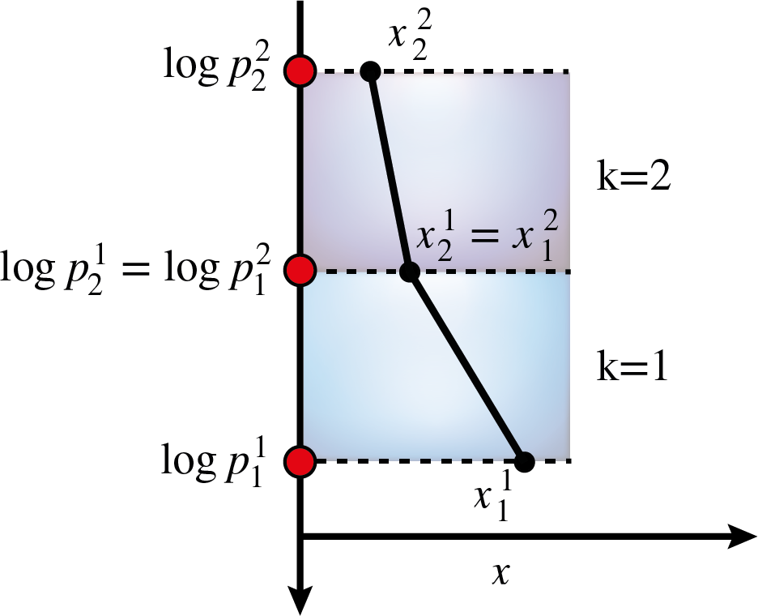
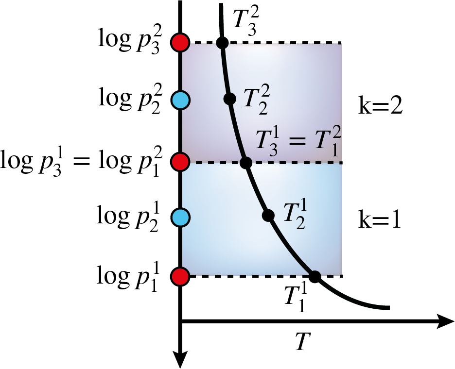

.. _sec:profile_parametrisations:

Parametrisations of vertical profiles
=====================================

The chemistry and the temperature structure models both
employ the same parametrisations to describe their atmospheric
profiles as a function of pressure. This section provides
a more detailed description of the different parametrisations
that are included in BeAR.

The following parametrisations are available:

  - isoprofiles

  - piecewise polynomials

  - cubic b splines

  - PCHIP (monotone piecewise cubic Hermite interpolation)

Isoprofiles
-----------

Isoprofiles are the most simple but also often used approximation 
for parametrising vertical profiles in a retrieval. In this approximation,
the abundance of a chemical species or the temperature is assumed to be 
constant throughout the atmosphere. 

This yields one free parameter for each chemical species included in the retrieval or 
for the constant temperature, respectively. 

Piecewise polynomials
---------------------

The description of vertically non-constant profiles using piecewise polynomials
is based on the idea of finite elements, see 
`Kitzmann et al. (2020) <https://ui.adsabs.harvard.edu/abs/2020ApJ...890..174K/>`_ for details. 
In this parametrisation, the atmosphere is separated into :math:`K` elements. 
This number is usually a user input. 

These elements are distributed equidistantly in log-pressure space. An example with
two elements is shown in the image below. The superscript numbers refer to the element
number, while the subscript ones denote the points inside of an element.

  
Within each element :math:`k`, the profle :math:`x^k` of a quantity :math:`x` as a function of
:math:`\log p` is then approximated as piecewise polynomial of order :math:`q`

.. math:: x^k(\log p) = \sum_{i=1}^{N_p} x^k(\log p_i^k) l_i^k(\log p)

where :math:`l_i` are the interpolating Lagrange polynomials trough the grid points :math:`\log p_i^k`.
The polynomial degree is also usually a user input.
The number of points :math:`N_p` inside an element are determined by the chosen polynomial degree:

.. math:: N_p = q + 1

Thus, for a first-order polynomial as shown above, two points in each element are required that
are connected by a straight line. The values of :math:`x` at the interface between two elements
are forced to be identical to create a continuous profile. In the example above, :math:`x^1_2` 
and :math:`x^2_1` have therefore the same value, decreasing the number of free parameters by 1.

The total number of free parameters :math:`N_x` for a piecewise, continuous polynomial of degree :math:`q` 
across :math:`K` elements is given by

.. math:: N_x = K q + 1

For example, a second-order polynomial across two elements would have 5 free parameters as shown below
for a temperature profile :math:`T(\log p)`.

The additional grid points :math:`\log p_i^k` inside an element are again distributed equidistantly
in log-pressure space. The free parameters for a retrieval are associated with the five discrete
points :math:`\log p_i^k` in this example. How they map onto the temperatures :math:`T_i^k` depends
on the chosen free-parameter mode (*relative* or *absolute*), described :ref:`below
<sec:relative_absolute>`. For the piecewise-polynomial temperature profile the default mode is
*relative*, in which the first parameter is the bottom temperature and the remaining ones are
multiplicative factors between adjacent control points.

In general, a more complex vertical profile requires either a greater number of elements or a 
higher polynomial degree. However, the polynomial degree should not be increased too much.
Otherwise, the resulting profile might suffer from oscillations, which is commonly referred to
as Runge's phenomenon. It is, therefore, usually better to increase the number of elements to
describe a more complex profile rather than the polynomial degree.
While BeAR supports polynomial degrees of up to 6, it is highly recommended to not go higher than
:math:`q = 3` to prevent oscillations in the vertical profile.

Cubic b splines
---------------

Cubic b splines are very similar to the piecewise polynomial model, in 
the sense that they also approximate the vertical profiles with polynomials.
For a cubic spline, the polynomial degree is obviously 3. However, in contrast
to the description with piecewise polynomials discussed above, cubic b splines
also put constraints on the derivatives of the profile and force the first
and second-order derivative to be continuous as well.

This usually creates a smoother profile compared to low-order piecewise polynomials 
and also tends to avoid oscillations due to Runge's phenomenon. However, it should
be noted that a more smooth profile is not necessarily more correct. In fact,
important information might be smoothed down in the vertical profiles.

BeAR uses the implementation of cubic b splines 
from the `Boost library <https://live.boost.org/doc/libs/1_65_0/libs/math/doc/html/math_toolkit/interpolate/cubic_b.html/>`_.
As free parameters, BeAR uses the values :math:`x_i` of a given quantity, such as mixing ratios of chemical species,
located at discrete pressure points :math:`\log p_i^k`. Like the implementation for the 
piecewise polynomials, these points are distributed equidistantly in logarithmic pressure space.

The total number of points is usually a user input. Typically, a greater number of points should
be used to describe more complex profiles, such as those with inversions.
Due to cubic splines being a third-order polynomial and the constraints on the first and second
derivative, the minimum number of points to create a cubic b spline is 5.

PCHIP
-----

The PCHIP parametrisation uses a monotone piecewise cubic Hermite interpolating polynomial
to describe the vertical profile. Like the cubic b spline, it is a piecewise cubic polynomial,
but instead of enforcing continuity of the second derivative it preserves monotonicity of the
data: the interpolant does not overshoot between control points and therefore does not introduce
spurious oscillations or inversions that are not already present in the control-point values.

BeAR uses the PCHIP implementation from the
`Boost library <https://www.boost.org/doc/libs/release/libs/math/doc/html/math_toolkit/pchip.html/>`__.
As with the other parametrisations, the control points are the values :math:`x_i` of a given
quantity located at pressure points :math:`\log p_i` that are distributed equidistantly in
logarithmic pressure space. The number of control points is a user input. In contrast to the
cubic b spline, which requires at least 5 control points, PCHIP only requires a minimum of 4.

.. _sec:relative_absolute:

Relative and absolute free parameters
-------------------------------------

For the piecewise polynomial, cubic b spline, and PCHIP parametrisations, the free parameters
that describe the profile can be specified in one of two modes. The mode is chosen by appending
an optional keyword to the ``params`` array in the ``forward_model.toml`` file, for example
``params = ["5", "absolute"]`` or ``params = ["k", "q", "relative"]``. If no keyword is given,
the per-model default is used. An unknown keyword raises an error.

In the **relative** mode, the first free parameter, identified by the prior name
:code:`temp_t0` (or the corresponding chemistry prior name), is the temperature (or abundance)
at the bottom of the atmosphere, i.e. the deepest, highest-pressure control point. Each
subsequent parameter :math:`b_i`, named :code:`temp_b1`, :code:`temp_b2`, ..., is a
multiplicative factor relating a control point to the previous one,

.. math:: T_i = T_{i-1}\, b_i .

By restricting the factors :math:`b_i`, e.g. to values not exceeding unity, the general shape
of the profile can be controlled and, for example, temperature inversions can be prevented.

In the **absolute** mode, each free parameter is the value at its control point directly,
using the prior names :code:`temp_t0`, :code:`temp_t1`, ....

The default mode depends on the parametrisation:

  - piecewise polynomials (``poly``): *relative*

  - cubic b splines (``cubicbspline``): *relative*

  - PCHIP (``pchip``): *absolute*

